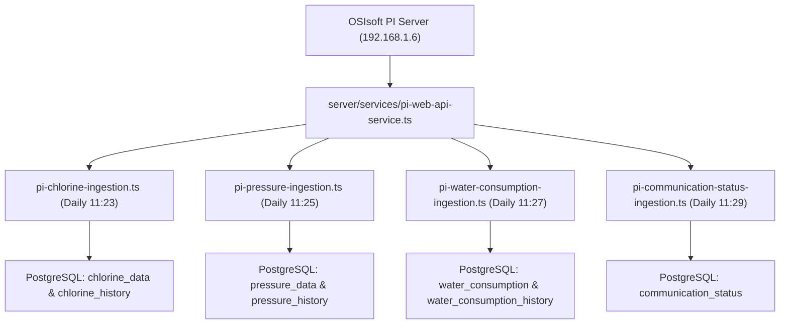

# OSIsoft PI Web API Ingestion & Technical Integration Guide

This document is the complete, official technical manual for the **OSIsoft PI Web API** data ingestion engine used by the background cron jobs (`server/cron/` and `server/services/pi-web-api-service.ts`) in the Mahajal IoT Platform.

---

## 1. Connection & Server Authentication

The background cron engine connects directly to the dedicated on-premise OSIsoft PI Web API instance:

* **PI Web API Base URL**: `https://192.168.1.6/piwebapi`
* **Authentication Method**: HTTP Basic Authentication
* **Default Service Account**: `.\piadmin`
* **Default Password**: `JJM@123`
* **Web / Read-Only Account**: `WebAppUser` / `WebAppUser@123`
* **Required Headers**:
  * `Authorization: Basic <base64-encoded-credentials>`
  * `Accept: application/json`
* **SSL Validation**: Self-signed internal certificates are bypassed using `rejectUnauthorized: false` in Node.js HTTPS Agents.

---

## 2. PI Asset Framework (AF) Hierarchy & Path Navigation

All physical IoT assets across Maharashtra are structured in a standardized **8-tier hierarchy** within the PI Asset Framework database at `\\DemoAF\JJM\JJM\Maharashtra`.

### 2.1 Complete 8-Tier Hierarchy Breakdown Table

| Tier Level | Administrative Level | Element Naming Pattern | Production Examples | Target Database Column |
| :--- | :--- | :--- | :--- | :--- |
| **Tier 1** | **State** | `Maharashtra` | `Maharashtra` | `state` |
| **Tier 2** | **Region** | `Region-<RegionName>` | `Region-Amravati`, `Region-Nagpur`, `Region-Pune`, `Region-Nashik`, `Region-Konkan`, `Region-Chhatrapati Sambhajinagar` | `region` |
| **Tier 3** | **Circle** | `Circle-<CircleName>` | `Circle-Akola`, `Circle-Nagpur`, `Circle-Pune`, `Circle-Amravati` | `circle` |
| **Tier 4** | **Division** | `Division-<DivisionName>` | `Division-Akola`, `Division-Washim`, `Division-Ramtek` | `division` |
| **Tier 5** | **Sub-Division** | `Sub Division-<SubDivName>` | `Sub Division-Akola`, `Sub Division-Murtizapur`, `Sub Division-Ramtek` | `sub_division` |
| **Tier 6** | **Block / Taluka** | `Block-<BlockName>` | `Block-Akola`, `Block-Barshitakali`, `Block-Ramtek` | `block` |
| **Tier 7** | **Scheme** | `Scheme-<SchemeID> - <SchemeName>` | `Scheme-20027951 - Khambora 60 VRRWSS Tq. & Dist. Akola`, `Scheme-631010 - Gobarwahi RR Retrofitting` | `scheme_id`<br>`scheme_name` |
| **Tier 8** | **Village** | `<VillageName>` or `Village-<VillageName>` | `Ambikapur`, `Alesur`, `Paunarkhari` | `village_name` |
| **Tier 9** | **Reservoir (ESR / MBR)** | `<ReservoirType> <Capacity> <Name>` | `Proposed 1.00 LL MBR-Outlet-1`, `ESR 1.00 LL`, `MBR 1.75 LL` | `esr_name` |

---

### 2.2 Hierarchical Relationship (Parent-to-Child)

* **1. State**: `Maharashtra`
  * **2. Region**: `Region-Amravati`
    * **3. Circle**: `Circle-Akola`
      * **4. Division**: `Division-Akola`
        * **5. Sub-Division**: `Sub Division-Akola`
          * **6. Block**: `Block-Akola`
            * **7. Scheme**: `Scheme-20027951 - Khambora 60 VRRWSS Tq. & Dist. Akola`
              * **8. Village**: `Ambikapur`
                * **9. Reservoir (ESR/MBR)**: `Proposed 1.00 LL MBR-Outlet-1`

---

### 2.3 Real-World Complete Asset Path:
```text
\\DemoAF\JJM\JJM\Maharashtra\Region-Amravati\Circle-Akola\Division-Akola\Sub Division-Akola\Block-Akola\Scheme-20027951 - Khambora 60 VRRWSS Tq. & Dist. Akola\Ambikapur\Proposed 1.00 LL MBR-Outlet-1
```

---

### 2.4 Path Extraction & Field Parsing Reference

When the crawler processes an asset path from the PI Web API, the path string is split by backslashes (`\`) to populate the relational database:

| Path Segment Index | Raw Path Segment in PI AF | Prefix Removed | Resulting Database Field | Clean Extracted Value |
| :--- | :--- | :--- | :--- | :--- |
| `parts[5]` | `Maharashtra` | *None* | `state` | `Maharashtra` |
| `parts[6]` | `Region-Amravati` | `Region-` | `region` | `Amravati` |
| `parts[7]` | `Circle-Akola` | `Circle-` | `circle` | `Akola` |
| `parts[8]` | `Division-Akola` | `Division-` | `division` | `Akola` |
| `parts[9]` | `Sub Division-Akola` | `Sub Division-` | `sub_division` | `Akola` |
| `parts[10]` | `Block-Akola` | `Block-` | `block` | `Akola` |
| `parts[11]` | `Scheme-20027951 - Khambora 60 VRRWSS...` | Regex `Scheme-(ID) - (Name)` | `scheme_id`<br>`scheme_name` | `20027951`<br>`Khambora 60 VRRWSS...` |
| `parts[12]` | `Ambikapur` | *None* | `village_name` | `Ambikapur` |
| `parts[13]` | `Proposed 1.00 LL MBR-Outlet-1` | *None* | `esr_name` | `Proposed 1.00 LL MBR-Outlet-1` |

---

## 3. Reservoir Template Discovery & Filtering

Because the PI AF tree contains thousands of non-reservoir folders, the crawler filters elements using their `TemplateName`.

### Active Production Templates:
1. **`MJP Reservoir Level - Active`** — Standard Elevated Storage Reservoirs (ESRs).
2. **`MJP Reservoir MBR FL & CL -  Level - Active`** — Master Balancing Reservoirs (MBRs) with integrated Flow and Chlorine analyzers.
3. **`MJP Reservoir MBR -  Level - Active`** — Standard Master Balancing Reservoirs (MBRs).

---

## 4. Real PI Web API Endpoints Used in Ingestion

The cron scripts use 5 core endpoints to crawl the tree, locate sensor attributes, and pull telemetry data.

---

### Endpoint 1: Resolve Root Path to WebID

* **Purpose**: Resolves the root state path into a `WebId` to start the crawler.
* **HTTP Method**: `GET`
* **Real URL**:
  ```http
  https://192.168.1.6/piwebapi/elements?path=\\DemoAF\JJM\JJM\Maharashtra
  ```

#### Real JSON Response:
```json
{
  "WebId": "E0k-7zR3_XEEa5vK9QdYwAAA_qE0yBq_k5xG_Q1AAA",
  "Id": "19b484fe-bf1b-419b-a7e8-e501a3501a01",
  "Name": "Maharashtra",
  "Path": "\\\\DemoAF\\JJM\\JJM\\Maharashtra",
  "TemplateName": null,
  "HasChildren": true,
  "Links": {
    "Self": "https://192.168.1.6/piwebapi/elements/E0k-7zR3_XEEa5vK9QdYwAAA_qE0yBq_k5xG_Q1AAA",
    "Elements": "https://192.168.1.6/piwebapi/elements/E0k-7zR3_XEEa5vK9QdYwAAA_qE0yBq_k5xG_Q1AAA/elements",
    "Attributes": "https://192.168.1.6/piwebapi/elements/E0k-7zR3_XEEa5vK9QdYwAAA_qE0yBq_k5xG_Q1AAA/attributes"
  }
}
```

---

### Endpoint 2: Recursive Child Element Enumeration

* **Purpose**: Traverses down the hierarchy to discover all Regions, Circles, Divisions, Schemes, Villages, and ESRs.
* **HTTP Method**: `GET`
* **Real URL**:
  ```http
  https://192.168.1.6/piwebapi/elements/{Parent_WebId}/elements?maxCount=100000
  ```
  *(Note: `?maxCount=100000` is mandatory to avoid the default 1,000-item cutoff).*

#### Real JSON Response (Child ESRs found inside Village):
```json
{
  "Items": [
    {
      "WebId": "E0k-7zR3_XEEa5vK9QdYwAAA_AMBIKAPUR_MBR1_WEBID",
      "Id": "7a3311de-3a9d-4e9e-b152-7b19810a9912",
      "Name": "Proposed 1.00 LL MBR-Outlet-1",
      "Path": "\\\\DemoAF\\JJM\\JJM\\Maharashtra\\Region-Amravati\\Circle-Akola\\Division-Akola\\Sub Division-Akola\\Block-Akola\\Scheme-20027951 - Khambora 60 VRRWSS Tq. & Dist. Akola\\Ambikapur\\Proposed 1.00 LL MBR-Outlet-1",
      "TemplateName": "MJP Reservoir MBR -  Level - Active",
      "HasChildren": false
    }
  ]
}
```

---

### Endpoint 3: Attribute (Sensor) Discovery by Name

* **Purpose**: Locates the specific sensor attribute on an ESR/MBR element and retrieves its unique `WebId` and value stream link.
* **HTTP Method**: `GET`
* **Real URL (Finding Chlorine Attribute)**:
  ```http
  https://192.168.1.6/piwebapi/elements/{Element_WebId}/attributes?nameFilter=Chlorine
  ```
* **Real URL (Finding Pressure Attribute)**:
  ```http
  https://192.168.1.6/piwebapi/elements/{Element_WebId}/attributes?nameFilter=Pressure
  ```
* **Real URL (Finding Daily Water Consumption Attribute)**:
  ```http
  https://192.168.1.6/piwebapi/elements/{Element_WebId}/attributes?nameFilter=CALC%20-%20WATER%20CONSUMPTION%20PER%20DAY
  ```

#### Real JSON Response:
```json
{
  "Items": [
    {
      "WebId": "A0k-7zR3_XEEa5vK9QdYwAAA_CHLORINE_ATTR_WEBID",
      "Id": "9b1285ef-1a3b-4c2d-9e11-881a2b3c4d5e",
      "Name": "Chlorine",
      "Description": "Residual Chlorine Sensor Reading",
      "Path": "\\\\DemoAF\\JJM\\JJM\\Maharashtra\\...\\Ambikapur\\Proposed 1.00 LL MBR-Outlet-1|Chlorine",
      "Type": "Single",
      "DefaultUnitsName": "mg/l",
      "Links": {
        "Value": "https://192.168.1.6/piwebapi/streams/A0k-7zR3_XEEa5vK9QdYwAAA_CHLORINE_ATTR_WEBID/value"
      }
    }
  ]
}
```

---

### Endpoint 4: Real-Time Instantaneous Value (Communication Check)

* **Purpose**: Fetches the live current value of an attribute to determine real-time connectivity and online communication status.
* **HTTP Method**: `GET`
* **Real URL**:
  ```http
  https://192.168.1.6/piwebapi/streams/{Attribute_WebId}/value
  ```

#### Real JSON Response (Healthy / Connected Sensor):
```json
{
  "Timestamp": "2026-08-25T07:30:00Z",
  "Value": 0.35,
  "UnitsAbbreviation": "mg/l",
  "Good": true,
  "Questionable": false,
  "Substituted": false
}
```

#### Real JSON Response (Communication 24hr Status = Online):
```json
{
  "Timestamp": "2026-08-25T07:30:00Z",
  "Value": 2,
  "Good": true
}
```

---

### Endpoint 5: 7-Day Daily Historical Summary Telemetry

* **Purpose**: Pulls daily summarized buckets (averages or totals) for historical analysis and dashboard table population.
* **HTTP Method**: `GET`

#### A. Chlorine & Pressure (Daily Average Summary):
* **Real URL**:
  ```http
  https://192.168.1.6/piwebapi/streams/{Attribute_WebId}/summary?startTime=2026-08-18&endTime=2026-08-25&summaryType=Average&summaryDuration=1d
  ```

#### B. Water Consumption (Daily Total Summary):
* **Real URL**:
  ```http
  https://192.168.1.6/piwebapi/streams/{Attribute_WebId}/summary?startTime=2026-08-18&endTime=2026-08-25&summaryType=Total&summaryDuration=1d
  ```

#### Real JSON Response (7-Day Daily Average Summary):
```json
{
  "Items": [
    {
      "Type": "Average",
      "Value": {
        "Timestamp": "2026-08-19T00:00:00Z",
        "Value": 0.28,
        "UnitsAbbreviation": "mg/l",
        "Good": true
      }
    },
    {
      "Type": "Average",
      "Value": {
        "Timestamp": "2026-08-20T00:00:00Z",
        "Value": 0.32,
        "UnitsAbbreviation": "mg/l",
        "Good": true
      }
    },
    {
      "Type": "Average",
      "Value": {
        "Timestamp": "2026-08-21T00:00:00Z",
        "Value": 0.45,
        "UnitsAbbreviation": "mg/l",
        "Good": true
      }
    },
    {
      "Type": "Average",
      "Value": {
        "Timestamp": "2026-08-22T00:00:00Z",
        "Value": 0.38,
        "UnitsAbbreviation": "mg/l",
        "Good": true
      }
    },
    {
      "Type": "Average",
      "Value": {
        "Timestamp": "2026-08-23T00:00:00Z",
        "Value": 0.29,
        "UnitsAbbreviation": "mg/l",
        "Good": true
      }
    },
    {
      "Type": "Average",
      "Value": {
        "Timestamp": "2026-08-24T00:00:00Z",
        "Value": 0.35,
        "UnitsAbbreviation": "mg/l",
        "Good": true
      }
    },
    {
      "Type": "Average",
      "Value": {
        "Timestamp": "2026-08-25T00:00:00Z",
        "Value": 0.31,
        "UnitsAbbreviation": "mg/l",
        "Good": true
      }
    }
  ]
}
```

---

## 5. Cron Ingestion Scripts & Database Mappings

The ingestion system consists of 4 scheduled cron jobs in `server/cron/`:



---

### 5.1 Chlorine Ingestion (`pi-chlorine-ingestion.ts`)

* **Schedule:** Daily at `11:23`
* **Attribute Queried:** `Chlorine`
* **PI Web API Query:** `summaryType=Average&summaryDuration=1d` over 7-day range.
* **Database Destination:** Table `chlorine_data` (upsert on `[scheme_id, village_name, esr_name]`) and `chlorine_history`.
* **Field Mapping:**

| PI Web API Data Source | Target Database Column | Data Type | Description |
| :--- | :--- | :--- | :--- |
| `Hierarchy parser` | `region`, `circle`, `division`, `sub_division`, `block` | `varchar(100)` | Administrative location. |
| `Hierarchy parser` | `scheme_id`, `scheme_name`, `village_name`, `esr_name` | `varchar(255)` | Primary identification keys. |
| `Summary items[0..6].Value.Value` | `chlorine_value_1` to `chlorine_value_7` | `decimal` | 7-day rolling daily chlorine averages. |
| `Summary items[0..6].Value.Timestamp` | `chlorine_date_day_1` to `chlorine_date_day_7` | `varchar(15)` | Formatted dates (e.g. `19-Aug`). |
| `Analytics counter` | `number_of_consistent_zero_value_in_chlorine` | `integer` | Count of days where reading was `0.0`. |
| `Analytics counter` | `chlorine_less_than_02_mgl` | `decimal` | Count of days where `0 < reading < 0.2`. |
| `Analytics counter` | `chlorine_between_02_05_mgl` | `decimal` | Count of days where `0.2 <= reading <= 0.5` (Safe). |
| `Analytics counter` | `chlorine_greater_than_05_mgl` | `decimal` | Count of days where `reading > 0.5`. |
| `PI AF Asset Path` | `dashboard_url` | `text` | Formatted PI Vision link. |

---

### 5.2 Pressure Ingestion (`pi-pressure-ingestion.ts`)

* **Schedule:** Daily at `11:25`
* **Attribute Queried:** `Pressure`
* **PI Web API Query:** `summaryType=Average&summaryDuration=1d` over 7-day range.
* **Database Destination:** Table `pressure_data` and `pressure_history`.
* **Field Mapping:**

| PI Web API Data Source | Target Database Column | Data Type | Description |
| :--- | :--- | :--- | :--- |
| `Summary items[0..6].Value.Value` | `pressure_value_1` to `pressure_value_7` | `decimal` | 7-day rolling daily pressure averages (m). |
| `Summary items[0..6].Value.Timestamp` | `pressure_date_day_1` to `pressure_date_day_7` | `varchar(15)` | Formatted dates (e.g. `19-Aug`). |
| `Analytics counter` | `number_of_consistent_zero_value_in_pressure` | `integer` | Count of days where pressure was `0.0`. |
| `Analytics counter` | `pressure_0_to_7_m` | `decimal` | Count of days with pressure `0 < p <= 7`. |
| `Analytics counter` | `pressure_7_to_12_m` | `decimal` | Count of days with pressure `7 < p <= 12` (Standard). |
| `Analytics counter` | `pressure_greater_than_12_m` | `decimal` | Count of days with pressure `p > 12`. |

---

### 5.3 Water Consumption Ingestion (`pi-water-consumption-ingestion.ts`)

* **Schedule:** Daily at `11:27`
* **Attribute Queried:** `CALC - WATER CONSUMPTION PER DAY`
* **PI Web API Query:** `summaryType=Total&summaryDuration=1d` over 7-day range.
* **Database Destination:** Table `water_consumption` and `water_consumption_history`.
* **Field Mapping:**

| PI Web API Data Source | Target Database Column | Data Type | Description |
| :--- | :--- | :--- | :--- |
| `Summary items[0..6].Value.Value` | `water_value_day1` to `water_value_day7` | `decimal` | 7-day rolling daily total volume in Liters. |
| `Summary items[0..6].Value.Timestamp` | `water_date_day1` to `water_date_day7` | `varchar(15)` | Associated consumption dates. |
| `Analytics counter` | `zero_value_count` | `integer` | Days with zero supply. |

---

### 5.4 Communication Status Ingestion (`pi-communication-status-ingestion.ts`)

* **Schedule:** Daily at `11:29`
* **Attributes Queried in Parallel per ESR:**
  1. `Chlorine`
  2. `Pressure`
  3. `Flow Rate`
  4. `Communication Status - Chlorine - 24hr`
  5. `Communication Status - Pressure - 24hr`
  6. `Communication Status - Flow Rate - 24hr`
  7. `Communication Status - Chlorine - 24hr - 72hr`
  8. `Communication Status - Pressure - 24hr - 72hr`
  9. `Communication Status - Flow Rate - 24hr - 72hr`
  10. `Communication Status - Chlorine - 72hr`
  11. `Communication Status - Pressure - 72hr`
  12. `Communication Status - Flow Rate - 72hr`

* **Database Destination:** Table `communication_status`.
* **Value Conversion Logic:**

| PI Web API Attribute | Raw API Return Value | Stored DB Column | Value Stored in DB |
| :--- | :--- | :--- | :--- |
| `Chlorine` / `Pressure` / `Flow Rate` | Number (e.g. `0.35`, `8.4`) | `chlorine_connected`, `pressure_connected`, `flow_meter_connected` | `'Connected'` |
| `Chlorine` / `Pressure` / `Flow Rate` | System State (`"Pt Created"`, `IsSystem: true`) | `chlorine_connected`, `pressure_connected`, `flow_meter_connected` | `'Not Connected'` |
| `Communication Status - * - 24hr` | `2` or `1` | `chlorine_status`, `pressure_status`, `flow_meter_status` | `'Online'` |
| `Communication Status - * - 24hr` | `0` | `chlorine_status`, `pressure_status`, `flow_meter_status` | `'Offline'` |
| `Communication Status - * - 24hr - 72hr` | `1` | `chlorine_0h_72h`, `pressure_0h_72h`, `flow_meter_0h_72h` | `'1'` |
| `Communication Status - * - 72hr` | `1` | `chlorine_72h`, `pressure_72h`, `flow_meter_72h` | `'1'` |

---

## 6. System Error States & "Pt Created" Filter Rules

### 6.1 What is "Pt Created"?
When a sensor point is created on the PI Server before physical telemetry has ever been wired or transmitted, the PI Web API returns an `IsSystem: true` object:

```json
{
  "Timestamp": "2026-08-25T00:00:00Z",
  "Value": {
    "Name": "Pt Created",
    "Value": 253,
    "IsSystem": true
  },
  "Good": false
}
```

### 6.2 Common PI System State Codes:
* **`Value: 253` (`"Pt Created"`):** Tag is configured in PI AF, but no hardware data has ever been received.
* **`Value: 255` (`"I/O Timeout"`):** Hardware stopped transmitting data.
* **`Value: 248` (`"Comm Error"`):** Network / modem transmission error.
* **`Value: 246` (`"Calc Failed"`):** Mathematical formula failed due to missing inputs.

### 6.3 Data Cleaning & Purge Rules:
1. **Partial Error Handling**: If a sensor was active for 3 days and returned "Pt Created" for 4 days, the 4 error days are converted to `0` and the valid records are preserved in the database.
2. **100% Pt Created Purge (Deletion)**: If **100% of the 7-day summary** returns "Pt Created" (or if the attribute physically does not exist on the AF element), the cron script deletes that ESR from `chlorine_data`, `pressure_data`, and `water_consumption` tables so it does not clutter the analytical dashboard with false zero rows.
3. **Communication Status Exception**: In `communication_status`, records with "Pt Created" are **not deleted**; they are logged as `"Not Connected"` and `"Offline"` so the field engineering team can identify unconfigured stations.
